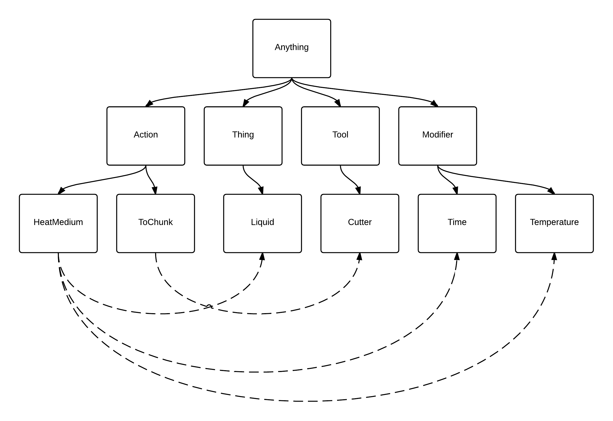
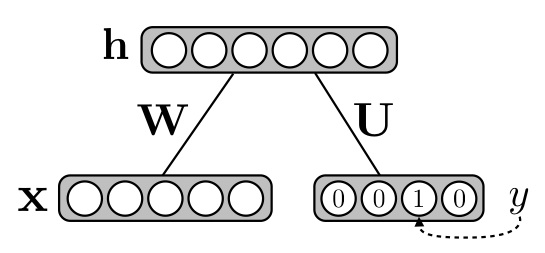
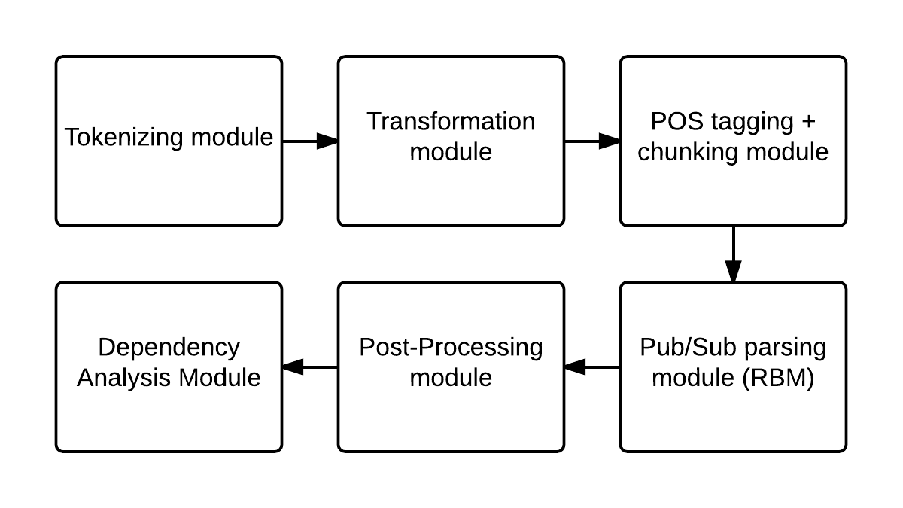

# Overall Task

The contribution of this project includes

1. design a pipeline and a representation to understand generic instructions
2. refine the approach to handle kitchen recipes, which are one type of instructions
3. evaluate and discuss the approach with a few kitchen recipes
4. show some future improvements to the approach

# I/O

The input is a list of English sentences that describe steps in an instruction.

```json
"Preheat the oven to 450 degrees F."
```

In one English sentence, there might be multiple steps.

The output is a list of steps in a representation that is similar to programming-language statements (See representation section).

```json
{
	Do: ActionHeatMedium,
	Tool: "oven",
	Temp: 450
}
```

# Motivation

Kitchen recipe is one type of text that has the densest semantics because it is usually written concisely. However, there are some _implied_ knowledges involved. For example, `"cover and cook for 20 minutes"` human beings know that `"20 minutes"` describes the duration of cooking rather than covering, because the action of covering should be quick. For another example, `"boiling_broth"` in different recipes might have different ingredients. As a result, the interaction between "action", "tool", "thing" plays an important role in understanding a recipe.

The design provides enough abstraction for all kinds of instructions, and does not limit to kitchen recipes. In general, the design should cover all kinds of instructions that can be described in form of `"Do thing with tools"`.

Finally, understanding single-entity instruction can give insights to multi-entity script such as a love story. The contribution of this project can be used as a sub-module for larger multi-entity projects.

# Emphasis/Methodology

The learning pipeline includes

1. Tokenizing
2. Transformation
3. POS tagging + chunking
4. Pub/Sub semantics parsing
5. Post-processing that completes "semantics fragment"
6. Dependency analysis

In the following subsections, I will describe some interesting details of the approach.

## Transformation

Based on morphological features, this module is able to

1. change token that is not all uppercase to all lowercase (abbreviation)
2. change noun and verb to singular

Although this seems simple, it reduces complexity of defining word or semantics dictionaries.

## POS Tagging and Chunking

In the past, POS tagging is finished before chunking, so the correctness of chunking depends on POS tagging. Therefore, research focuses on highly accurate POS tagging algorithms like maximum entropy or HMM with surrounding tag assignments. In Stanford research paper, @manning2011part points out that in the past decade, per-word POS tagging can achieve accuracy of ~97%; however, accuracy for whole sentence is still at ~56%. It is easy to see that low sentence POS accuracy makes chunking a much harder task.

The problem is that POS tagger needs a global view of the sentence instead of local features. Subsequently I define the task of POS tagging as a SAT problem: given a sequence of words and a set of possible tags for each word, find word tag assignments that satisfies the grammar. The grammar is described in regexp, and the chunking information is described as regexp captures.

(See Appendix: Chunking)

Consider the following grammar,

```json
{
	"PNP": "Prep NP",
	"NP": "(?:Adj|Unit)* Noun+",
	"NP_LIST": "NP (?:(?:Comma|Conj)+ NP)*",
	"VERB_LIST": "Verb (?:(?:Comma|Conj)+ Verb)*",

	"MODIFIER": "Adv? Prep? (Unit*) (PNP?)",
	"ACTION": "(Noun?) (VERB_LIST) (Adv*) (Prep? NP_LIST|Adj)? MODIFIER",

	"PNP_ACTION": "(PNP) Comma ACTION",
	"SIMPLE_ACTION": "(Conj) ACTION Comma ACTION",

	"SENT": "(?:PNP_ACTION|SIMPLE_ACTION) Period"
}
```

The all-uppercase terms can be expanded, and the terms surrounded by parentheses are regexp captures that represent chunks. Once a satisfying word tag assignment is found, chunks in a sentence are immediately determined.

### Semantics and Chunking

Defining semantics based on words is hard to capture precise meanings. For example, the phrase, `"on the other hand"`, is almost impossible to define with words, "on", "the", "other" and "hand" individually because the semantics dictionary will need to take into account _how one word is used in all possible combinations with all other words_. In contrast, it is easy to define `"on the other hand"` as a semantics unit. Therefore, in this project I give meanings to a chunk rather than a word.

## Pub/Sub Semantics Parsing

Pub/Sub model is commonly used to decouple publishers from subscribers. In the project, a chunk is the basic semantics unit that can both publish and subscribe meanings. Two chunks can be _linked_ together and create meanings if one chunk publishes a label and the other subscribes to the same label in the same sentence.  It is noteworthy that in regular pub/sub system, the publisher can publish multiple labels but in this project the publisher publish only one label. It simplifies the pub/sub diagram from a graph with back-links to a tree with back-links.

(See Appendix: Pub/Sub Parsing)



### Pub/Sub with NN (RBM)
For publishing information, every chunk(phrase) is categorized into one high-level category: action, tool, thing, none with softmax (1-out-of-N) RBM classifier, and then it is further classified into one sub-category with other softmax RBM classifier based on its high-level category.

For subscribing information, every chunk(phrase) is related to other sub-categories with regular RBM (M-out-of-N). There are two types of relations encoded:

1. an action to sub-categories of tools, things and modifiers (generate steps)
2. a thing to sub-categories of actions (further differentiate a thing in addition to its publishing information)

All these learnings are supervised and done before parsing steps.

## Post-processing

Post-processing uses *continuity assumptions* to auto-complete the inputs and outputs of each step so that they create a meaningful flow. The primary problem solved in this module is reconciliation of things.

1. penetrate: if the input of the current step does not exist, then the input of the current step is the output of the previous step.
2. pass-through: if the output of the current step does not exist and there is only one input, then the output is the same as the input.
3. look-around: if the output of the current step does not exist, then the output of the current step is the closest satisfying input after the current step, or the closest satisfying (assigned) output before the current step.

These rules are mutually exclusive and exhaustive, searching for things that can be reconciled. 

(See Appendix: Post-processing)

## Dependency Analysis

Dependency analysis not only helps debugging but also demonstrates the benefits of the representation.

Dependency can be further classified as "direct" and "indirect". With direct dependency and transitivity property, it is simple to calculate indirect dependency.

Direct dependency is calculated by "finding the minimum set of previous actions whose inputs and outputs cover the entire inputs of the current step". The algorithm uses `O(number of inputs)` space and `O(number of steps^2)` time.

(See Appendix: Dependency Analysis)

# Background

This section describes regular RBM and RBM classifier that I coded from equations of the original papers and @hinton2010practical.

## RBM

RBM is a undirected generative neural net that uses one hidden layer to model the distribution of one visible layer, In each layer, the unit state is binary, and there is no connection between layer units. This bi-partite structure indicates that layer units are independent, and learning function gradient can be computed in parallel.

@hinton2002training shows that stacking many RBMs to form a deep neural net can model any complex distribution. In addition, contrastive divergence and later persistent contrastive divergence can be used to train RBM efficient.


Sigmoid function is often used to reconstruct unit states between hidden and visible layer.

## RBM Classifier

While RBM is commonly used to initialize a deep feed-forward neural net, @larochelle2008classification show that RBM is a viable classifier instead of just a stepping stone. The change from regular RBM is that the visible layer is now divided into input and output, where the output layer uses softmax function to choose one out of all possible classes.



@larochelle2008classification also construct discriminative RBM classifier that models conditional distribution `p(y|x)` instead of joint distribution `p(x, y)`. Because of the simplification, the gradient can be written in closed form. 

# Architecture/Module

\ 

# Fixed vs. Learned Components/Knowledge

* Fixed
	- possible tag assignment for each word
	- grammar used in each instruction
	- pub/sub categories
* Learned
	- pub/sub assignments for each chunk (optional)
	- parsed instruction

(See demo section for project code link)

# Representation

```go
type Step interface {
	Action() string
	Input() []string
	Output() []string
	Tool() []string
	Skip() bool
	String() string
}
```

This interface shows that a step contains action, inputs, outputs, tools, skip indicator, and a English-sentence string representation.

Conceptually, this interface can be translated into a programming-language statement.

```go
if Skip {
	Output = Action(Tool, Input)
}
```

This representation brings many advances in compiler to this project, such as

* dependency analysis
* step reordering
* step merging

Moreover, there are multiple implementations of this interface. Switching to a more advanced implementation can encode complicated semantics in a step. For example, in Phase2, ContinueStep models an action that is performed until specific stop conditions are satisfied like time and temperature.

# Data/Corpora

Wordnet is used to assign a word possible POS tags.

# Instrumentation/Evaluation

To measure performance of this approach, I selected a few recipes from allrecipe.com. After the system processed each recipes, each step was then analyzed by myself to see where and why the system made mistakes.

For this kind of project, accuracy measurements from a huge dataset is not only infeasible but also inappropriate because many errors could eventually result from one underlying problem.

# Programming Languages and Software Packages

* Programming language: Go (http://golang.org)
* Software package: 
	- RBM (http://github.com/taylorchu/rbm)

# Phases

* Phase1: Parse basic steps
	- plain action, tool, thing
* Phase2: Parse step with temperature and time information
	- define what action can subscribe to temperature and time information
	- parse temperature and time phrases into go int and time.Duration respectively
* Phase3: Parse step with complicated semantics
	- reconciliation
	- complex condition

# Experiments

In this experiment, I picked a random but common recipe from allrecipe.com. It has not only time and temperature but also a *nasty* reconciliation problem. For example, "beef, breadcrumbs, and milk" is "meatball" but not "boiling broth" or "soup".

| `In a large stock pot, bring water, carrots, potatoes, onion, salsa, and bouillon cubes to a boil.`
| `Reduce to a medium simmer with 200 degrees F, stirring occasionally, approximately 10 minutes.`
| `Mix the beef, breadcrumbs, and milk together in a bowl.`
| `Form into 1-inch meatballs, and drop into boiling broth.`
| `Once soup returns to a boil, reduce heat to medium-low.`
| `Cover and cook 20 minutes, or until meatballs are no longer pink in center, and vegetables are tender.`
| `Serve with sprinkled cilantro for garnish.`

## Set-Up and Results

I put all sentences of this recipe into an array of string and fed into the system. 

| `Step 0: COOK carrot,potato,onion,bouillon_cube,water AT HIGH WITH large_stock_pot (boiling_broth).`
| `Step 1: COOK boiling_broth (boiling_broth) FOR 10m0s TIL TEMPERATURE REACHES 200°F.`
| `Step 2: MIX boiling_broth INTO boiling_broth (boiling_broth).`
| `Step 3: MIX breadcrumb,beef,milk INTO meatball WITH bowl (meatball).`
| `Step 4: CUT meatball INTO CHUNKS (meatball).`
| `Step 5: MIX meatball,boiling_broth INTO soup (soup).`
| `Step 6: COOK soup AT HIGH (soup).`
| `Step 7: COOK soup AT MEDIUM LOW (soup).`
| `Step 8: PUT meatball ON THE SURFACE OF vegetable (vegetable).`
| `Step 9: COOK meatball,vegetable (soup) FOR 20m0s.`
| `Step 10: PUT sprinkled_cilantro ON THE SURFACE OF soup (soup).`

| `Step 0 directly depends on []`
| `Step 1 directly depends on [0]`
| `Step 2 directly depends on [1]`
| `Step 3 directly depends on []`
| `Step 4 directly depends on [3]`
| `Step 5 directly depends on [4 2]`
| `Step 6 directly depends on [5]`
| `Step 7 directly depends on [6]`
| `Step 8 directly depends on [5]`
| `Step 9 directly depends on [8]`
| `Step 10 directly depends on [9]`

## Evaluation and Discussion

For BasicStep, RBM can correctly classify a chunk into a high-level category and sub-category. In addition, action, thing and tool bind correctly with in a sentence. For ContinueStep, time and temperature also bind to the right step. For example, `20m0s` binds to step 9 but not step 8 where the time information is possible to bind to both.

In addition to pub/sub parsing, post-processing successfully generates the correct flow. For example, step 4 and step 5 show that it handles the case where some inputs are omitted. For another example, in step 0, the system knows that the output is `boiling_broth` but not meatball, even though meatball occurs first. This is because the system knows that meatball cannot possibly be produced by `"cooking with large_stock_pot (container)"`. The system  __pinpoints semantics of one chunk with other chunks__. An alternative approach is to add in knowledge about food ingredients; because `"carrot,potato,onion,bouillon_cube,water"` does not contain `"meat"`, it cannot possibly produce `"meatball"`. __Disambiguating two chunks with ingredient knowledges__ will be a future work for this project.

Finally, because handling complex condition is still a work in progress, the system cannot handle the part `"until meatballs are no longer pink in center, and vegetables are tender"`. In step 8 and step 9, this semantics error happens but it does not interfere with the robust post-processing rules. For example, the output of step 9 is still `"soup"`.

After auto-completing inputs and outputs of each step, the system uses this knowledge to analyze the dependencies of each step. It is easy to see that step 0, 1, 2 can be grouped to form a larger step, and step 3, 4 can also be grouped. Then step 5 takes in the outputs of the two larger steps. Interestingly, this cannot be easily noticed in plain English sentences.

In the future, this project should also work on other details of the semantics. For example, the phrase, "for garnish", is ignored. The task like this will likely to add several other branches in the tree hierarchy of the Pub/Sub parsing module. 

# Current Status

I successfully completed Phase1 and Phase2, and started Phase3 (See phases section).

## Demo
The demo is a self-contained binary to show the entire pipeline. 

The release differs from the experiment build,

* Wordnet dictionaries are removed and hard-coded due to license incompatibility.
* RBM trained weight files are removed due to large file size, and the desired output is hard-coded.
* Input example is hard-coded to one specific recipe because both RBM and Wordnet dictionaries are missing.

The code is available on github (http://github.com/taylorchu/blueprint).

# References
